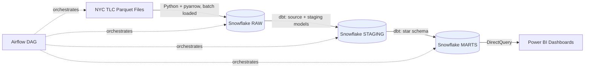
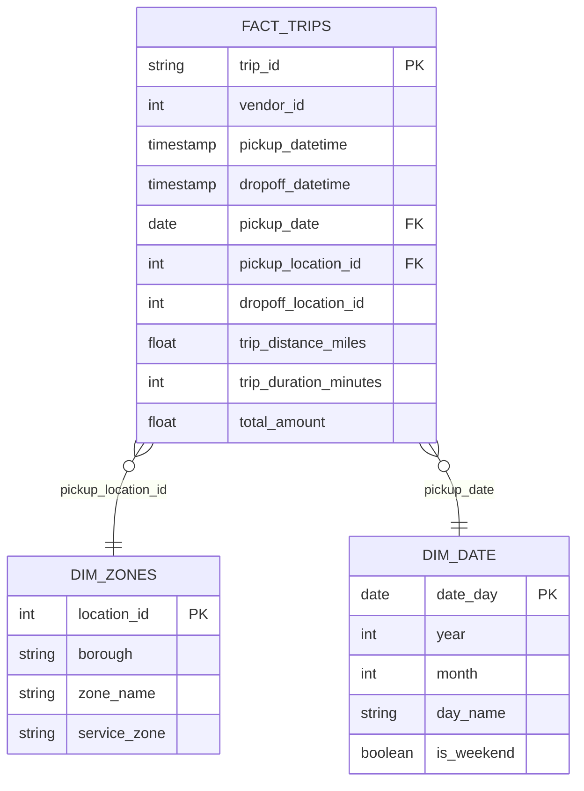
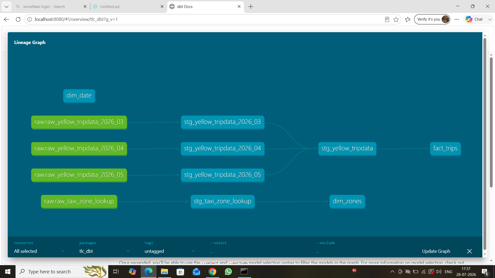
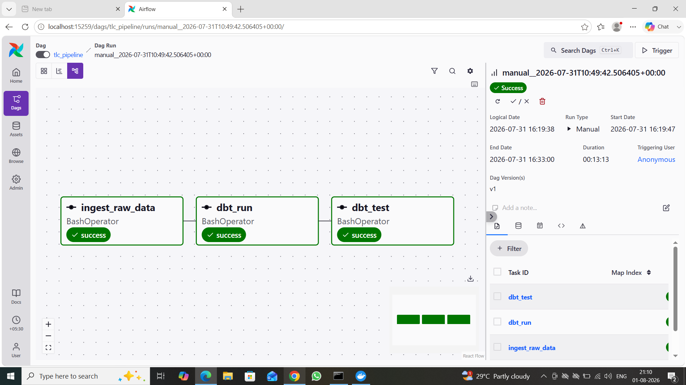
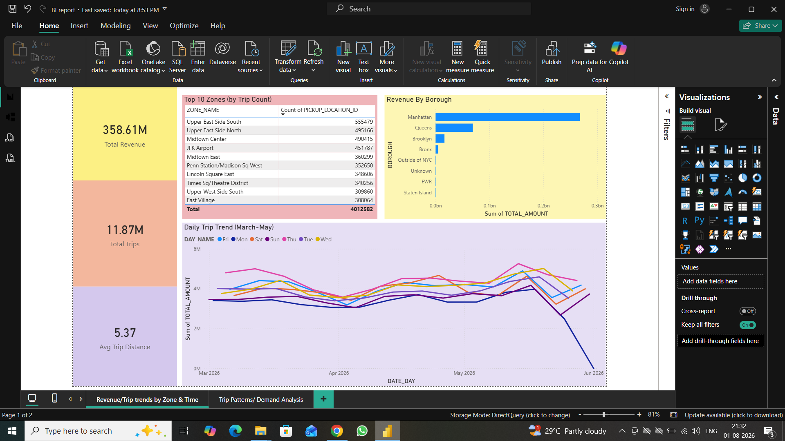
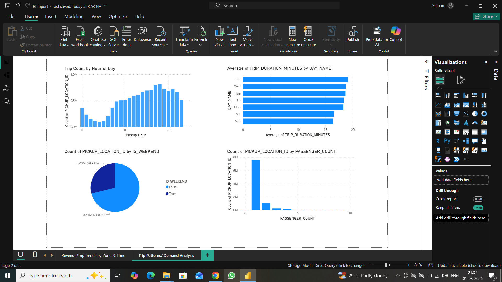

# NYC Taxi Analytics Pipeline

An end-to-end modern data stack project: raw government trip data goes
in, tested and orchestrated analytics dashboards come out.

**Stack:** Snowflake · dbt · Apache Airflow (via Astro CLI) · Power BI · Python

---

## Overview

This project ingests, cleans, models, tests, orchestrates, and
visualizes ~11.9 million real NYC taxi trip records (March-May 2026),
sourced directly from the NYC Taxi & Limousine Commission's official
public data.

It's built to mirror how a real analytics/data engineering team
actually works: raw data lands untouched, gets transformed through a
tested staging → marts pipeline, is fully orchestrated end-to-end via
Airflow, and feeds live dashboards — not a one-off notebook analysis.

## Architecture



**Data flow:** `Ingest → Staging → Marts (star schema) → Dashboards`,
fully automated by an Airflow DAG running `ingest → dbt run → dbt test`
in sequence with automatic retries.

## Star Schema



## Tech Stack & Why

| Layer | Tool | Why |
|---|---|---|
| Warehouse | Snowflake | Industry-standard cloud data warehouse |
| Ingestion | Python (pandas, pyarrow, snowflake-connector) | Batch-streamed loading, memory-safe on constrained hardware |
| Transformation | dbt Core | The current standard for analytics engineering: version-controlled, tested, documented SQL |
| Orchestration | Apache Airflow (Astro CLI / Docker) | Schedules and automates the full pipeline with retry logic |
| Visualization | Power BI (DirectQuery) | Live dashboards without duplicating data locally |

## Key Engineering Decisions & Data Quality Findings

This wasn't a clean, frictionless build — and that's worth documenting
honestly, because the debugging is as much a part of the engineering
work as the happy path:

- **Memory-safe ingestion**: initial version loaded entire parquet
  files into memory at once. Rewrote to stream files in 200K-row
  batches via `pyarrow.parquet.ParquetFile.iter_batches()`, making it
  robust even in memory-constrained environments (Docker containers
  with as little as ~2GB available).
- **No genuine unique trip ID exists in the source data.** Discovered
  via a `dbt test` failure: a naive hash of vendor + timestamps + zones
  produced 61,000+ duplicate keys across 11.9M rows. Fixed by adding a
  `ROW_NUMBER() OVER (PARTITION BY ...)` window function as a
  tiebreaker before hashing, guaranteeing true uniqueness.
- **Corrupted timestamps**: ~23 rows had timestamps far outside the
  known data range (likely GPS/meter clock errors at the source) —
  caught by a `relationships` test against the date dimension, then
  filtered out explicitly with a documented rationale in the model.
- **Raw timestamp encoding bug**: source timestamps were stored as
  microseconds since epoch, not the assumed nanoseconds — caught by
  eyeballing suspicious 1970-01-01 dates in staging output, not by an
  automated test, a reminder that tests complement but don't replace
  manual review.
- **Containerized orchestration debugging**: tracked down a genuine
  upstream bug (`dbt-core` + Python 3.14 incompatibility with a
  dependency called `mashumaro`, confirmed via dbt-core's GitHub issue
  tracker) and resolved it by pinning the Airflow Docker image to an
  explicit Python 3.12 base.

## Repository Structure

```
nyc-taxi-pipeline/
├── ingestion/              # Python ingestion scripts
├── tlc_dbt/                 # dbt project (staging + marts models, tests, docs)
│   ├── models/
│   │   ├── staging/         # Cleaned, typed, unioned source data
│   │   └── marts/           # Star schema: fact_trips, dim_zones, dim_date
│   └── macros/
├── airflow_project/         # Astro CLI / Airflow orchestration
│   └── dags/
├── data/raw/                 # (gitignored) local copies of source parquet/csv
└── docs/                     # Screenshots: lineage graph, DAG, dashboards
```

## Dashboards

**Revenue & Trends** — total revenue, trip counts, average distance;
revenue by borough; daily revenue trend; top 10 zones by trip volume.

**Trip Patterns & Demand** — trips by hour of day; weekday vs. weekend
split; average trip duration by day of week; passenger count
distribution.

*(Screenshots below)*






## Running This Project

1. **Snowflake**: create a warehouse/database/schemas — see
   `ingestion/00_setup_snowflake.sql`
2. **Ingestion**: `pip install -r requirements.txt`, fill in `.env`
   from `.env.example`, download NYC TLC parquet files into
   `data/raw/`, run `python ingestion/load_raw_to_snowflake.py`
3. **dbt**: `cd tlc_dbt`, `dbt run`, `dbt test`
4. **Airflow**: `cd airflow_project`, `astro dev start`, trigger the
   `tlc_pipeline` DAG from `localhost:8080`
5. **Power BI**: connect to Snowflake (`MARTS` schema) via DirectQuery

## Data Source

[NYC Taxi & Limousine Commission — Trip Record Data](https://www.nyc.gov/site/tlc/about/tlc-trip-record-data.page)
(official, publicly available government data)

## Author

Yashika Sen — [GitHub](https://github.com/yashika07) ·
[LinkedIn](https://www.linkedin.com/in/yashika-sen-28622616b/)
